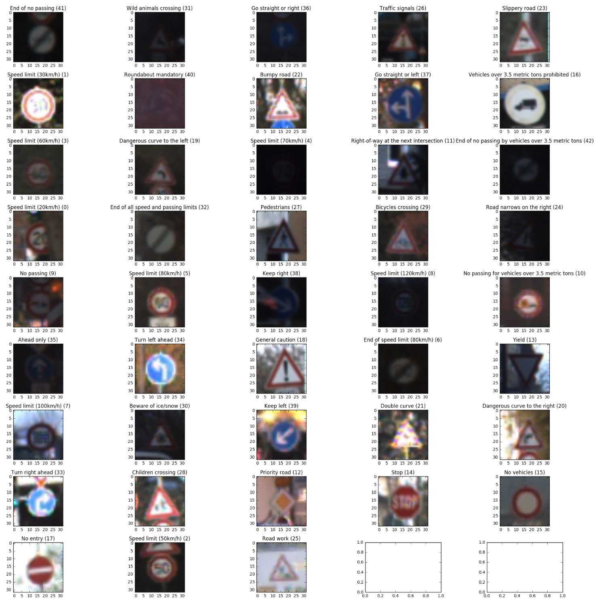
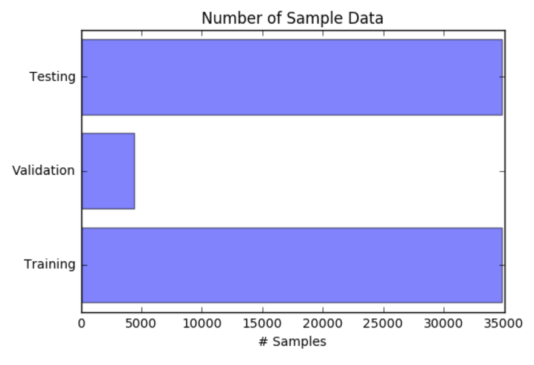
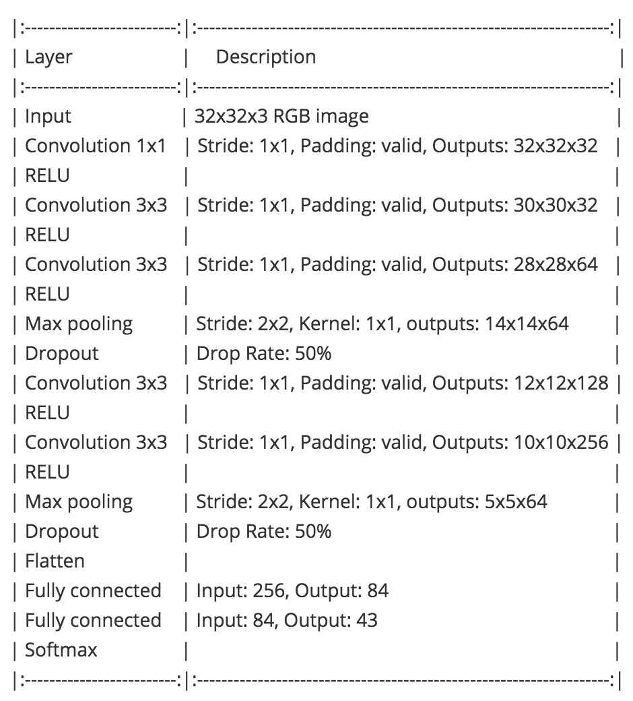
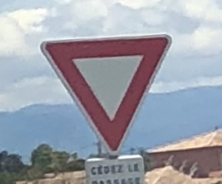
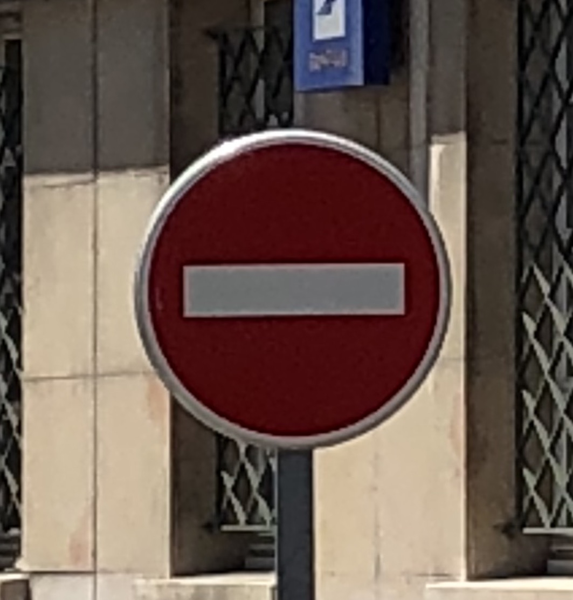
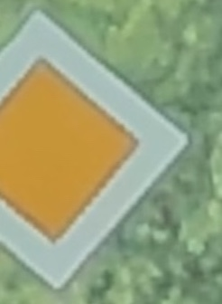
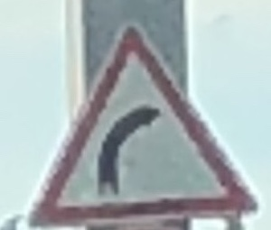
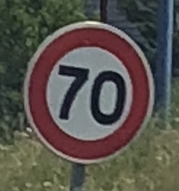
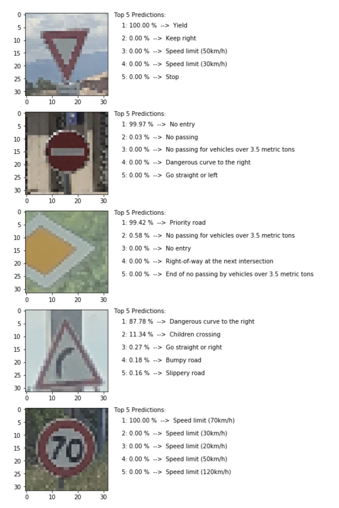

# **Traffic Sign Recognition** 

## Writeup

### You can use this file as a template for your writeup if you want to submit it as a markdown file, but feel free to use some other method and submit a pdf if you prefer.

---

**Build a Traffic Sign Recognition Project**

The goals / steps of this project are the following:
- Load the data set (see below for links to the project data set)
- Explore, summarize and visualize the data set
- Design, train and test a model architecture
- Use the model to make predictions on new images
- Analyze the softmax probabilities of the new images
- Summarize the results with a written report

## Rubric Points
### Here I will consider the [rubric points](https://review.udacity.com/#!/rubrics/481/view) individually and describe how I addressed each point in my implementation.  

---
### Writeup / README
You're reading it! and here is a link to my [project code](https://github.com/KentonParton/traffic_sign_classifier.git/Traffic_Sign_Classifier.ipynb)

### Data Set Summary & Exploration
#### 1. Basic Summary of Dataset

I used the built in Python .len function and Pandas .shape function to generate a statistics summary for the traffic
sign data set:

#### The following stats are calculated/displayed:
- The size of **training set** is: 34,799
- The size of the **validation set** is: 4,410
- The size of **test set** is: 34,799
- The **shape** of a traffic sign image is: (32, 32, 1)
- The number of **unique classes/labels** in the data set is: 43

#### 2. Include an exploratory visualization of the dataset.

**Visualization of dataset classes**

**Bar Chart Visualization of Dataset**

### Design and Model Architecture
#### 1. Image Pre-processing
The image data was received as Pickle files containing 32x32x3 Numpy arrays specifying each pixel value.
- **Pixel --> 3 Channels (Red,Greeen,Blue) with each channel ranging from 0 to 255.**
Initially, the images were going to be converted to grayscale; however,  color can be considered a feature of road signs; therefore, they were left in color. While this  would require a longer training time (more parameters), it would result in a more accurate classification model.

Regarding normalization, images were normalized using Min-Max scaling between [0.1, 0.9]. Seeing that pixels of an image fall within a bounded interval (0 - 255) making Min-Max Scaling and effective normaliztion method.

#### 2. Model Architecture

My final model consisted of the following layers:

My model followed the notion that CNN's need to be deeper rather than wider. This was done by using a series of 3x3 convolutional layers which increased in depth with each proceeding convolution. This approach was based on the VGGNet architecture which demonstrated that reducing the filter size (3x3) and increasing the depth could yield a more accurate model.

To reduce the number of parameters, a 1x1 convolution was used in the first layer, acting as another form of preproccessing to reduce the training time of the model. Furthermore, two dropout layers at 50% were used to prevent the model from overfitting and to promote new features being detected. 

#### 3. Training Process

To train the model, a library named scikit-optimized was used to perform a series of training iterations to test for the best hyperperameters such as learning-rate and batch size; it was also used to test different network structures. Based on the training iterations, the network performed best with two dropout layers directly after the two max pooling layers, a

#### 4. Approach to my final architecture

First, a base case was established to create a "MVP", which in this case was the LeNet architecture. After the LeNet architecture was edited to suit the traffic sign data, a series of tests and architectural changes were made to LeNet, specifically the output depth and kernel size for each convolutional layer. After minor changes to the architecture and adding a dropout layer, a validation accuracy of 95% was acheived. As the models accuracy increased the training time increased exponentially which made me look for another archetectural structure.

After reading a number of research papers, smaller implementations of GoogLeNet, and VGGNet were created. Based on my implementations of  GoogLeNet and VGGNet, VGGNet performed better. 

My final model results were:
- Training set accuracy of: 99.4%
- Validation set accuracy of: 97.3%
- Test set (5 images) accuracy of: 100%

### Test a Model on New Images
#### 1. Image Test Set (taken using my phone)

Below are 5 traffic signs taken in France. 4 of the signs are identical to German traffic signs; however, one traffic sign is unseen by the network which is noted below.

1. Yield

2. No Entry

3. Priority Road

4. Dangerous Right Curve (French Road Sign, unseen by network)

5. Speed Limit (70km/h)

The model was able to correctly predict 5 out of the 5 signs of which, a portion of one sign had been cropped and another sign was unseen.

#### 2. Model Predictions

Here are the results of the prediction:

Images 1, 2, 3, and 5 were easily identified with an accuracy above 99%, presumably because the image are well lit and clear while some of the images in the training set were very dark. This made these images easier to predict.  While image 3 had an accuracy of 99.42%, a quarter of the sign was cropped to test if the model could classify the image correctly. While a portion of the sign was cropped, it is the only traffic sign with yellow. This may have resulted in a higher accuracy prediction. Out of the 5 images, image 4 had a much lower accuracy of 87.78% as it is a French traffic sign and isn't the same as the German equivalent. This demonstrates how the model is able to generalize when it receives similar data.
